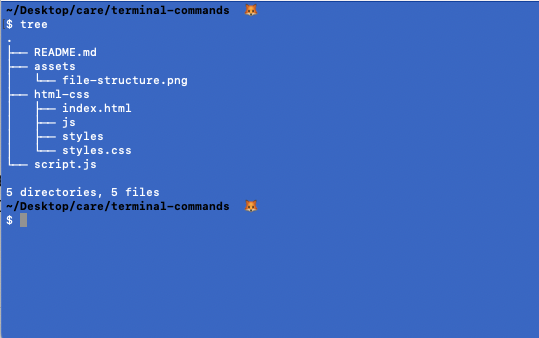

[](https://generalassemb.ly)
<br>
# Care Review

## CLI

<details>
    <summary>1. What command is used for showing all files and directories including hidden files from the current working directory?</summary>

        ls -a
</details><br>
<details>
    <summary>2. Given the above file structure how can I move styles.css into the directory of styles from ~/Desktop/care/review</summary>

        mv html-css/styles.css html-css/styles/
</details><br>
<details>
    <summary>3. Given the above file structure how can I copy copy.js into the directory of html-css from ~/Desktop/care/review</summary>

        cp copy.js html-css/copy.js
</details><br>

## JS Basics
<details>
    <summary>1. Name as many primative JS data types as you can remember. There are 7</summary>

        string, number, boolean, undefined, null, bigInt, symbol
</details><br>
<details>
    <summary>2. Name two data structures in JS that you have learned about</summary>

        array and object
</details><br>
<details>
    <summary>3. Describe control flow and name a few ways to code control flow. Name three types</summary>

        The ordering of when code is executed.
        - sequential flow (top to bottom)
        - conditional flow (if, else if, else)
        - repetitive flow (looping) 
</details><br>

## Conditionals
1.  Make a temp variable. 
2. Write a chaining conditional statement that 
    - checks if the temp is > 90 and logs 'it is hot'
    - checks if temp is > 70 and logs 'it is pretty nice'
    - finally a catch all (else) with a log of 'nothing above is truthy' 

## Loops
```
const foods = ['pizza', 'ice cream', 'salad']
```
1. Write a loop of your choice that loops through the above array and logs each element with a string added, 'is sooo good!'

## Arrays
```
const foods = ['pizza', 'ice cream', 'salad']
```
1. Access the last element in the above array.
2. Change pizza to hamburger.
3. Add the string of 'cake' to the front of the array with an array method.
4. Loop through the array with the forEach() array method. 

## Objects
```
const myDog = {
    name: 'Klondike',
    breed: 'Goldent Retriever',
    activies: ['fetching the ball', 'hiking'],
    age: 6.5
}
```
1. Access the string of hiking in the myDog object.
2. Update the age key of myDog to 7.
3. Loop through myDog and log the values of each key.

## Functions/Scope
```
function calculate(num1, num2, operator){
    let result
}
console.log(calculate(2, 4, 'add'))
```
1. What are the parameters of this function?
2. What are the arguments of this function?
3. What is the purpose of `return`
4. Complete this function so that when the function runs it returns a result of 8. 
5. If I console.log(result) outside of the function, what would you expect and why?